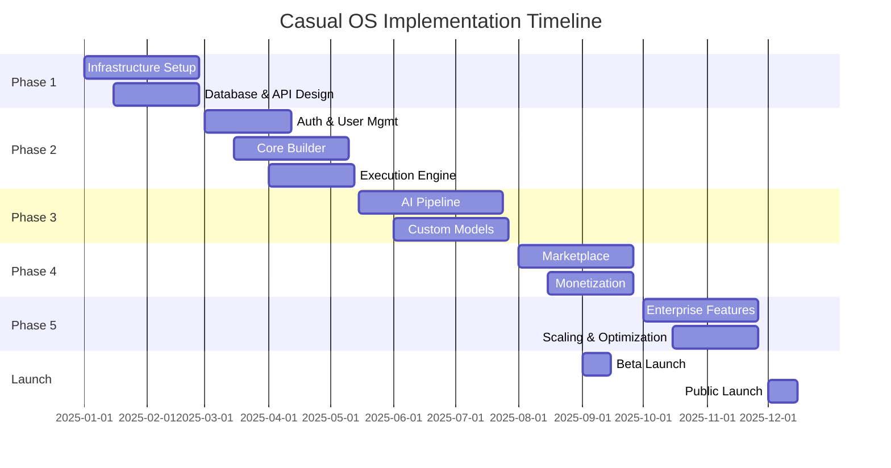

# 🚀 Casual OS - Complete Implementation Plan

## Executive Summary
This comprehensive implementation plan outlines the complete development roadmap for Casual OS, an AI-powered application development platform that enables users to create sophisticated applications through natural language descriptions. The plan spans 12-15 months and covers all technical, business, and operational aspects.

## 📋 Table of Contents
1. [Architecture Overview](#architecture-overview)
2. [Phase 1: Foundation & Infrastructure](#phase-1-foundation--infrastructure)
3. [Phase 2: Core Platform Development](#phase-2-core-platform-development)
4. [Phase 3: AI & Generation Engine](#phase-3-ai--generation-engine)
5. [Phase 4: Marketplace & Monetization](#phase-4-marketplace--monetization)
6. [Phase 5: Enterprise & Scale](#phase-5-enterprise--scale)
7. [Technical Implementation Details](#technical-implementation-details)
8. [Risk Management](#risk-management)
9. [Success Metrics](#success-metrics)
10. [Timeline & Milestones](#timeline--milestones)

---

## 🏗️ Architecture Overview

### System Architecture Layers

```
┌─────────────────────────────────────────────────────────────┐
│                     Presentation Layer                       │
│  • Next.js 14 Web App  • React Native Mobile  • CLI Tool    │
└─────────────────────────────────────────────────────────────┘
                              │
┌─────────────────────────────────────────────────────────────┐
│                      API Gateway Layer                       │
│     • Kong/Envoy  • Rate Limiting  • Authentication         │
└─────────────────────────────────────────────────────────────┘
                              │
┌─────────────────────────────────────────────────────────────┐
│                    Microservices Layer                       │
│  • Auth Service    • Generation Service  • Execution Service │
│  • Marketplace     • Collaboration       • Analytics         │
└─────────────────────────────────────────────────────────────┘
                              │
┌─────────────────────────────────────────────────────────────┐
│                         AI Layer                             │
│  • Intent Analysis  • Code Generation  • Optimization        │
│  • GPT-4/Claude    • Custom Models     • Vector DB          │
└─────────────────────────────────────────────────────────────┘
                              │
┌─────────────────────────────────────────────────────────────┐
│                     Data & Storage Layer                     │
│  • PostgreSQL  • Redis  • S3/R2  • TimescaleDB  • Elastic   │
└─────────────────────────────────────────────────────────────┘
                              │
┌─────────────────────────────────────────────────────────────┐
│                   Infrastructure Layer                       │
│  • Kubernetes  • Docker  • Terraform  • Monitoring          │
└─────────────────────────────────────────────────────────────┘
```

---

## 📅 Phase 1: Foundation & Infrastructure
**Duration: 8-10 weeks | Team: 6-8 engineers**

### 1.1 Infrastructure Setup

#### Cloud Infrastructure
```yaml
Provider: AWS / GCP / Azure (multi-cloud)
Regions: 
  - Primary: us-east-1
  - Secondary: eu-west-1
  - Tertiary: ap-southeast-1

Core Services:
  Compute:
    - EKS/GKE clusters (3 per region)
    - Node groups: 3-50 nodes auto-scaling
    - Instance types: t3.medium to c5.4xlarge
  
  Storage:
    - S3/GCS for object storage
    - EBS/Persistent Disks for block storage
    - CloudFront/Cloud CDN for content delivery
  
  Database:
    - RDS PostgreSQL (Multi-AZ, Read replicas)
    - ElastiCache Redis clusters
    - DocumentDB/MongoDB for unstructured data
  
  Networking:
    - VPC with public/private subnets
    - NAT Gateways for outbound traffic
    - Application Load Balancers
    - Route 53/Cloud DNS for DNS management
```

#### DevOps Setup
```yaml
CI/CD Pipeline:
  - GitHub Actions for CI
  - ArgoCD for GitOps deployments
  - Terraform for infrastructure as code
  - Helm charts for Kubernetes deployments

Monitoring Stack:
  - Prometheus + Grafana for metrics
  - ELK Stack for logging
  - Jaeger for distributed tracing
  - PagerDuty for alerting
  - Datadog for APM

Security:
  - Vault for secrets management
  - Falco for runtime security
  - Trivy for vulnerability scanning
  - OWASP ZAP for security testing
```

### 1.2 Database Design

#### Primary PostgreSQL Schema
```sql
-- Users and Authentication
CREATE TABLE users (
    id UUID PRIMARY KEY DEFAULT gen_random_uuid(),
    email VARCHAR(255) UNIQUE NOT NULL,
    username VARCHAR(50) UNIQUE,
    password_hash VARCHAR(255),
    email_verified BOOLEAN DEFAULT FALSE,
    two_factor_enabled BOOLEAN DEFAULT FALSE,
    two_factor_secret VARCHAR(255),
    status VARCHAR(20) DEFAULT 'active',
    created_at TIMESTAMP DEFAULT CURRENT_TIMESTAMP,
    updated_at TIMESTAMP DEFAULT CURRENT_TIMESTAMP,
    last_login TIMESTAMP,
    metadata JSONB
);

CREATE TABLE user_profiles (
    user_id UUID PRIMARY KEY REFERENCES users(id),
    first_name VARCHAR(100),
    last_name VARCHAR(100),
    display_name VARCHAR(100),
    avatar_url TEXT,
    bio TEXT,
    website VARCHAR(255),
    location VARCHAR(255),
    timezone VARCHAR(50),
    preferences JSONB,
    settings JSONB
);

-- Organizations and Teams
CREATE TABLE organizations (
    id UUID PRIMARY KEY DEFAULT gen_random_uuid(),
    name VARCHAR(255) NOT NULL,
    slug VARCHAR(100) UNIQUE NOT NULL,
    description TEXT,
    logo_url TEXT,
    website VARCHAR(255),
    settings JSONB,
    subscription_id UUID,
    created_at TIMESTAMP DEFAULT CURRENT_TIMESTAMP,
    updated_at TIMESTAMP DEFAULT CURRENT_TIMESTAMP
);

CREATE TABLE organization_members (
    id UUID PRIMARY KEY DEFAULT gen_random_uuid(),
    organization_id UUID REFERENCES organizations(id),
    user_id UUID REFERENCES users(id),
    role VARCHAR(50) NOT NULL,
    permissions JSONB,
    invited_by UUID REFERENCES users(id),
    invited_at TIMESTAMP,
    joined_at TIMESTAMP,
    status VARCHAR(20) DEFAULT 'invited',
    UNIQUE(organization_id, user_id)
);

-- Applications
CREATE TABLE applications (
    id UUID PRIMARY KEY DEFAULT gen_random_uuid(),
    name VARCHAR(255) NOT NULL,
    description TEXT,
    manifest JSONB NOT NULL,
    owner_id UUID REFERENCES users(id),
    organization_id UUID REFERENCES organizations(id),
    visibility VARCHAR(20) DEFAULT 'private',
    status VARCHAR(20) DEFAULT 'draft',
    version VARCHAR(20) DEFAULT '0.1.0',
    category VARCHAR(50),
    tags TEXT[],
    icon_url TEXT,
    screenshots TEXT[],
    created_at TIMESTAMP DEFAULT CURRENT_TIMESTAMP,
    updated_at TIMESTAMP DEFAULT CURRENT_TIMESTAMP,
    published_at TIMESTAMP,
    deleted_at TIMESTAMP
);

CREATE TABLE app_versions (
    id UUID PRIMARY KEY DEFAULT gen_random_uuid(),
    app_id UUID REFERENCES applications(id),
    version VARCHAR(20) NOT NULL,
    manifest JSONB NOT NULL,
    changelog TEXT,
    created_by UUID REFERENCES users(id),
    created_at TIMESTAMP DEFAULT CURRENT_TIMESTAMP,
    downloads INTEGER DEFAULT 0,
    deprecated BOOLEAN DEFAULT FALSE,
    UNIQUE(app_id, version)
);

-- Executions
CREATE TABLE executions (
    id UUID PRIMARY KEY DEFAULT gen_random_uuid(),
    app_id UUID REFERENCES applications(id),
    user_id UUID REFERENCES users(id),
    version VARCHAR(20),
    inputs JSONB,
    outputs JSONB,
    status VARCHAR(20) NOT NULL,
    started_at TIMESTAMP DEFAULT CURRENT_TIMESTAMP,
    completed_at TIMESTAMP,
    duration INTEGER,
    error JSONB,
    metrics JSONB,
    cost DECIMAL(10, 4),
    sandbox_config JSONB
);

-- Marketplace
CREATE TABLE marketplace_listings (
    id UUID PRIMARY KEY DEFAULT gen_random_uuid(),
    app_id UUID REFERENCES applications(id) UNIQUE,
    pricing_model VARCHAR(20),
    price DECIMAL(10, 2),
    currency VARCHAR(3) DEFAULT 'USD',
    trial_days INTEGER DEFAULT 0,
    featured BOOLEAN DEFAULT FALSE,
    verified BOOLEAN DEFAULT FALSE,
    stats JSONB,
    created_at TIMESTAMP DEFAULT CURRENT_TIMESTAMP,
    updated_at TIMESTAMP DEFAULT CURRENT_TIMESTAMP
);

CREATE TABLE reviews (
    id UUID PRIMARY KEY DEFAULT gen_random_uuid(),
    app_id UUID REFERENCES applications(id),
    user_id UUID REFERENCES users(id),
    rating INTEGER CHECK (rating >= 1 AND rating <= 5),
    title VARCHAR(255),
    content TEXT,
    pros TEXT[],
    cons TEXT[],
    recommended BOOLEAN DEFAULT TRUE,
    helpful_count INTEGER DEFAULT 0,
    created_at TIMESTAMP DEFAULT CURRENT_TIMESTAMP,
    updated_at TIMESTAMP DEFAULT CURRENT_TIMESTAMP,
    UNIQUE(app_id, user_id)
);

-- Subscriptions and Billing
CREATE TABLE subscriptions (
    id UUID PRIMARY KEY DEFAULT gen_random_uuid(),
    user_id UUID REFERENCES users(id),
    organization_id UUID REFERENCES organizations(id),
    tier VARCHAR(20) NOT NULL,
    status VARCHAR(20) NOT NULL,
    current_period_start TIMESTAMP,
    current_period_end TIMESTAMP,
    cancel_at_period_end BOOLEAN DEFAULT FALSE,
    trial_start TIMESTAMP,
    trial_end TIMESTAMP,
    stripe_subscription_id VARCHAR(255),
    metadata JSONB,
    created_at TIMESTAMP DEFAULT CURRENT_TIMESTAMP,
    updated_at TIMESTAMP DEFAULT CURRENT_TIMESTAMP
);

-- Collaboration
CREATE TABLE collaboration_sessions (
    id UUID PRIMARY KEY DEFAULT gen_random_uuid(),
    app_id UUID REFERENCES applications(id),
    host_id UUID REFERENCES users(id),
    status VARCHAR(20) DEFAULT 'active',
    started_at TIMESTAMP DEFAULT CURRENT_TIMESTAMP,
    ended_at TIMESTAMP,
    settings JSONB,
    participants JSONB
);

-- Indexes
CREATE INDEX idx_users_email ON users(email);
CREATE INDEX idx_users_username ON users(username);
CREATE INDEX idx_applications_owner ON applications(owner_id);
CREATE INDEX idx_applications_status ON applications(status);
CREATE INDEX idx_applications_visibility ON applications(visibility);
CREATE INDEX idx_executions_app ON executions(app_id);
CREATE INDEX idx_executions_user ON executions(user_id);
CREATE INDEX idx_executions_status ON executions(status);
CREATE INDEX idx_marketplace_featured ON marketplace_listings(featured);
CREATE INDEX idx_reviews_app ON reviews(app_id);
```

### 1.3 API Architecture

#### RESTful API Design
```typescript
// Base API Structure
const API_BASE = 'https://api.casualos.com/v1';

// Authentication Endpoints
POST   /auth/register
POST   /auth/login
POST   /auth/logout
POST   /auth/refresh
POST   /auth/verify-email
POST   /auth/reset-password
POST   /auth/2fa/enable
POST   /auth/2fa/verify
DELETE /auth/2fa/disable

// User Management
GET    /users/me
PUT    /users/me
DELETE /users/me
GET    /users/:id
GET    /users/:id/apps
GET    /users/:id/activity

// Application Management
GET    /apps                 // List user's apps
POST   /apps                 // Create new app
GET    /apps/:id            // Get app details
PUT    /apps/:id            // Update app
DELETE /apps/:id            // Delete app
POST   /apps/:id/publish    // Publish to marketplace
POST   /apps/:id/execute    // Execute app
GET    /apps/:id/executions // Get execution history
POST   /apps/:id/fork       // Fork an app
GET    /apps/:id/versions   // Get version history
POST   /apps/:id/versions   // Create new version

// AI Generation
POST   /generate/analyze    // Analyze intent from prompt
POST   /generate/manifest   // Generate app manifest
POST   /generate/components // Generate components
POST   /generate/optimize   // Optimize existing app
POST   /generate/explain    // Explain generated code

// Marketplace
GET    /marketplace/apps    // Browse marketplace
GET    /marketplace/search  // Search apps
GET    /marketplace/featured // Featured apps
GET    /marketplace/categories
POST   /marketplace/install/:id
POST   /marketplace/review/:id
GET    /marketplace/reviews/:id

// Collaboration
POST   /collaboration/sessions        // Start session
GET    /collaboration/sessions/:id    // Get session info
POST   /collaboration/sessions/:id/join
POST   /collaboration/sessions/:id/leave
WS     /collaboration/sessions/:id/ws // WebSocket connection

// Teams & Organizations  
GET    /organizations
POST   /organizations
GET    /organizations/:id
PUT    /organizations/:id
DELETE /organizations/:id
POST   /organizations/:id/members
DELETE /organizations/:id/members/:userId

// Billing & Subscriptions
GET    /billing/subscription
POST   /billing/subscription
PUT    /billing/subscription
DELETE /billing/subscription
GET    /billing/invoices
GET    /billing/usage
POST   /billing/payment-methods
```

#### GraphQL Schema
```graphql
type Query {
  # User queries
  me: User!
  user(id: ID!): User
  users(filter: UserFilter, pagination: Pagination): UserConnection!
  
  # App queries
  app(id: ID!): Application
  apps(filter: AppFilter, sort: AppSort, pagination: Pagination): AppConnection!
  
  # Marketplace queries
  marketplace(filter: MarketplaceFilter, sort: MarketplaceSort, pagination: Pagination): MarketplaceConnection!
  
  # Execution queries
  execution(id: ID!): Execution
  executions(appId: ID!, filter: ExecutionFilter, pagination: Pagination): ExecutionConnection!
  
  # Analytics queries
  analytics(appId: ID!, period: DateRange): Analytics!
  usage(period: DateRange): UsageMetrics!
}

type Mutation {
  # Authentication
  register(input: RegisterInput!): AuthPayload!
  login(input: LoginInput!): AuthPayload!
  logout: Boolean!
  refreshToken(token: String!): AuthPayload!
  
  # App mutations
  createApp(input: CreateAppInput!): App!
  updateApp(id: ID!, input: UpdateAppInput!): App!
  deleteApp(id: ID!): Boolean!
  publishApp(id: ID!, input: PublishInput!): App!
  executeApp(id: ID!, input: ExecutionInput!): Execution!
  
  # Generation mutations
  generateApp(prompt: String!, options: GenerationOptions): GenerationResult!
  regenerateComponent(appId: ID!, componentId: ID!, prompt: String!): Component!
  
  # Collaboration mutations
  startCollaboration(appId: ID!): CollaborationSession!
  inviteCollaborator(sessionId: ID!, email: String!, role: CollaboratorRole!): Invitation!
}

type Subscription {
  # Real-time updates
  appUpdated(id: ID!): App!
  executionProgress(id: ID!): ExecutionUpdate!
  collaborationChanges(sessionId: ID!): CollaborationEvent!
  marketplaceUpdates(category: Category): MarketplaceUpdate!
}
```

---

## 🔨 Phase 2: Core Platform Development
**Duration: 10-12 weeks | Team: 10-12 engineers**

### 2.1 Authentication & User Management

#### Implementation Steps
1. **OAuth2/OIDC Provider Integration**
   - Google, GitHub, Microsoft Azure AD
   - Apple Sign In
   - SAML 2.0 for enterprise SSO

2. **Multi-Factor Authentication**
   - TOTP (Time-based One-Time Password)
   - SMS verification (Twilio)
   - WebAuthn/FIDO2 support
   - Backup codes

3. **Session Management**
   - JWT tokens with refresh mechanism
   - Redis session store
   - Device fingerprinting
   - Concurrent session limits

4. **Permission System**
   - RBAC (Role-Based Access Control)
   - ABAC (Attribute-Based Access Control)
   - Dynamic permissions
   - Resource-level permissions

#### Security Implementation
```typescript
// Authentication Service
class AuthenticationService {
  async register(input: RegisterInput): Promise<AuthResult> {
    // 1. Validate input
    const validation = await this.validateRegistration(input);
    if (!validation.valid) throw new ValidationError(validation.errors);
    
    // 2. Check existing user
    const existing = await this.userRepo.findByEmail(input.email);
    if (existing) throw new ConflictError('Email already registered');
    
    // 3. Hash password
    const hashedPassword = await bcrypt.hash(input.password, 12);
    
    // 4. Create user
    const user = await this.userRepo.create({
      email: input.email,
      passwordHash: hashedPassword,
      profile: input.profile,
    });
    
    // 5. Send verification email
    await this.emailService.sendVerification(user);
    
    // 6. Generate tokens
    const tokens = await this.generateTokens(user);
    
    // 7. Create session
    await this.sessionService.create(user.id, tokens.refreshToken);
    
    return { user, tokens };
  }
  
  async login(input: LoginInput): Promise<AuthResult> {
    // 1. Find user
    const user = await this.userRepo.findByEmail(input.email);
    if (!user) throw new UnauthorizedError('Invalid credentials');
    
    // 2. Verify password
    const valid = await bcrypt.compare(input.password, user.passwordHash);
    if (!valid) throw new UnauthorizedError('Invalid credentials');
    
    // 3. Check 2FA if enabled
    if (user.twoFactorEnabled) {
      const valid2FA = await this.verify2FA(user, input.twoFactorCode);
      if (!valid2FA) throw new UnauthorizedError('Invalid 2FA code');
    }
    
    // 4. Generate tokens
    const tokens = await this.generateTokens(user);
    
    // 5. Update last login
    await this.userRepo.updateLastLogin(user.id);
    
    // 6. Create session
    await this.sessionService.create(user.id, tokens.refreshToken);
    
    return { user, tokens };
  }
  
  private async generateTokens(user: User): Promise<TokenPair> {
    const accessToken = jwt.sign(
      { 
        sub: user.id, 
        email: user.email,
        roles: user.roles,
        permissions: user.permissions,
      },
      process.env.JWT_SECRET,
      { expiresIn: '15m' }
    );
    
    const refreshToken = jwt.sign(
      { sub: user.id, type: 'refresh' },
      process.env.JWT_REFRESH_SECRET,
      { expiresIn: '7d' }
    );
    
    return { accessToken, refreshToken };
  }
}
```

### 2.2 App Builder Core

#### Visual Builder Components
1. **Canvas System**
   - Infinite canvas with zoom/pan
   - Grid snapping and alignment guides
   - Component hierarchy tree
   - Layers panel with visibility controls

2. **Component Library**
   - 50+ pre-built components
   - Custom component creation
   - Component templates
   - Version control for components

3. **Property Panel**
   - Dynamic property editing
   - Data binding interface
   - Event handler configuration
   - Styling controls

4. **Preview System**
   - Real-time preview
   - Device simulation
   - Responsive breakpoints
   - Interactive testing

#### Drag-and-Drop Implementation
```typescript
// DnD System using @dnd-kit
interface DragDropContext {
  draggedItem: Component | null;
  dropTarget: DropZone | null;
  isDragging: boolean;
  canDrop: boolean;
  preview: PreviewData | null;
}

class VisualBuilder {
  private canvas: Canvas;
  private components: ComponentRegistry;
  private history: HistoryManager;
  private dnd: DragDropManager;
  
  constructor() {
    this.canvas = new Canvas({
      width: 'infinite',
      height: 'infinite',
      gridSize: 8,
      snapToGrid: true,
    });
    
    this.components = new ComponentRegistry();
    this.history = new HistoryManager(50); // 50 undo levels
    this.dnd = new DragDropManager();
  }
  
  addComponent(component: Component, position: Position) {
    // 1. Validate placement
    if (!this.canPlaceComponent(component, position)) {
      throw new PlacementError('Invalid placement position');
    }
    
    // 2. Add to canvas
    const placed = this.canvas.addComponent(component, position);
    
    // 3. Setup connections
    this.setupComponentConnections(placed);
    
    // 4. Add to history
    this.history.push({
      action: 'add',
      component: placed,
      timestamp: Date.now(),
    });
    
    // 5. Trigger update
    this.emit('componentAdded', placed);
  }
  
  moveComponent(componentId: string, newPosition: Position) {
    const component = this.canvas.getComponent(componentId);
    if (!component) throw new NotFoundError('Component not found');
    
    // 1. Store old position
    const oldPosition = component.position;
    
    // 2. Move component
    this.canvas.moveComponent(componentId, newPosition);
    
    // 3. Update connections
    this.updateComponentConnections(componentId);
    
    // 4. Add to history
    this.history.push({
      action: 'move',
      component: componentId,
      from: oldPosition,
      to: newPosition,
      timestamp: Date.now(),
    });
    
    // 5. Trigger update
    this.emit('componentMoved', { componentId, oldPosition, newPosition });
  }
}
```

### 2.3 Execution Engine

#### Sandbox Architecture
```typescript
// Execution Sandbox using Firecracker/gVisor
class ExecutionSandbox {
  private vm: MicroVM;
  private filesystem: VirtualFS;
  private network: NetworkNamespace;
  private resources: ResourceLimits;
  
  async execute(app: Application, inputs: any): Promise<ExecutionResult> {
    // 1. Create isolated VM
    this.vm = await this.createVM({
      vcpus: 1,
      memory: 128, // MB
      kernel: 'vmlinux-5.10',
      rootfs: 'alpine-minirootfs',
    });
    
    // 2. Setup filesystem
    this.filesystem = await this.setupFilesystem(app);
    
    // 3. Configure network
    this.network = await this.setupNetwork({
      allowlist: app.manifest.permissions.network.allowlist,
      rateLimit: 1000, // requests per minute
    });
    
    // 4. Set resource limits
    this.resources = {
      cpuQuota: 100000, // microseconds
      memoryLimit: 128 * 1024 * 1024, // bytes
      pids: 50,
      fileDescriptors: 100,
      diskQuota: 50 * 1024 * 1024, // bytes
    };
    
    // 5. Inject app code
    await this.injectCode(app.manifest.code);
    
    // 6. Execute with timeout
    const result = await this.runWithTimeout(
      () => this.vm.execute(inputs),
      app.manifest.requirements.executionTime
    );
    
    // 7. Collect metrics
    const metrics = await this.collectMetrics();
    
    // 8. Cleanup
    await this.cleanup();
    
    return {
      outputs: result,
      metrics,
      logs: this.vm.logs,
      status: 'completed',
    };
  }
  
  private async runWithTimeout<T>(
    fn: () => Promise<T>,
    timeout: number
  ): Promise<T> {
    return Promise.race([
      fn(),
      new Promise<never>((_, reject) =>
        setTimeout(() => reject(new TimeoutError()), timeout)
      ),
    ]);
  }
}
```

---

## 🤖 Phase 3: AI & Generation Engine
**Duration: 12-14 weeks | Team: 8-10 engineers (including ML specialists)**

### 3.1 AI Pipeline Architecture

#### Multi-Model System
```python
# AI Generation Pipeline
class AIGenerationPipeline:
    def __init__(self):
        self.intent_analyzer = IntentAnalyzer(model="gpt-4")
        self.architect = ArchitectureDesigner(model="claude-3")
        self.code_generator = CodeGenerator(model="codex")
        self.optimizer = CodeOptimizer(model="custom-fine-tuned")
        self.validator = CodeValidator()
        
    async def generate_app(self, prompt: str, context: dict) -> AppManifest:
        # 1. Analyze user intent
        intent = await self.intent_analyzer.analyze(prompt, context)
        
        # 2. Design architecture
        architecture = await self.architect.design(intent)
        
        # 3. Generate components
        components = []
        for component_spec in architecture.components:
            code = await self.code_generator.generate(component_spec)
            optimized = await self.optimizer.optimize(code)
            validated = await self.validator.validate(optimized)
            components.append(validated)
        
        # 4. Generate connections
        connections = await self.generate_connections(components)
        
        # 5. Create manifest
        manifest = AppManifest(
            metadata=self.extract_metadata(prompt, intent),
            components=components,
            connections=connections,
            layout=self.determine_layout(components),
            theme=self.suggest_theme(intent),
            requirements=self.calculate_requirements(components),
        )
        
        # 6. Final validation
        await self.validate_manifest(manifest)
        
        return manifest
```

#### Intent Analysis System
```python
class IntentAnalyzer:
    def __init__(self, model: str):
        self.llm = LLMClient(model)
        self.embeddings = EmbeddingModel()
        self.vector_db = VectorDatabase()
        
    async def analyze(self, prompt: str, context: dict) -> IntentAnalysis:
        # 1. Extract key phrases
        key_phrases = await self.extract_key_phrases(prompt)
        
        # 2. Classify intent type
        intent_type = await self.classify_intent(prompt)
        
        # 3. Extract requirements
        requirements = await self.extract_requirements(prompt)
        
        # 4. Find similar apps
        similar_apps = await self.find_similar_apps(prompt)
        
        # 5. Determine complexity
        complexity = await self.estimate_complexity(requirements)
        
        # 6. Generate structured intent
        structured_prompt = f"""
        Analyze the following app request and extract structured requirements:
        
        User Prompt: {prompt}
        Intent Type: {intent_type}
        Key Phrases: {', '.join(key_phrases)}
        Similar Apps: {similar_apps}
        
        Extract:
        1. Primary goal
        2. Functional requirements (list)
        3. Data requirements (inputs/outputs)
        4. UI components needed
        5. Integrations required
        6. Non-functional requirements
        """
        
        response = await self.llm.complete(structured_prompt)
        
        return IntentAnalysis(
            primary_goal=response.primary_goal,
            functional_requirements=response.functional_requirements,
            data_requirements=response.data_requirements,
            ui_components=response.ui_components,
            integrations=response.integrations,
            non_functional_requirements=response.non_functional_requirements,
            complexity=complexity,
            confidence=self.calculate_confidence(response),
        )
```

#### Code Generation Engine
```python
class CodeGenerator:
    def __init__(self, model: str):
        self.llm = LLMClient(model)
        self.templates = TemplateLibrary()
        self.validators = CodeValidators()
        
    async def generate(self, spec: ComponentSpec) -> GeneratedCode:
        # 1. Select base template
        template = self.templates.get_best_match(spec)
        
        # 2. Generate component code
        prompt = self.build_generation_prompt(spec, template)
        raw_code = await self.llm.generate_code(prompt)
        
        # 3. Post-process code
        processed = await self.post_process(raw_code, spec)
        
        # 4. Add error handling
        with_errors = self.add_error_handling(processed)
        
        # 5. Add logging
        with_logging = self.add_logging(with_errors)
        
        # 6. Optimize
        optimized = await self.optimize_code(with_logging)
        
        # 7. Validate
        validation = await self.validators.validate(optimized)
        if not validation.valid:
            # Attempt to fix issues
            fixed = await self.auto_fix_issues(optimized, validation.issues)
            return fixed
        
        return GeneratedCode(
            source=optimized,
            language=spec.language,
            dependencies=self.extract_dependencies(optimized),
            metadata={
                'generated_at': datetime.now(),
                'model': self.llm.model,
                'spec': spec.to_dict(),
            }
        )
```

### 3.2 Training Custom Models

#### Fine-Tuning Pipeline
```python
# Custom Model Training for Casual OS
class ModelTrainer:
    def __init__(self):
        self.base_model = "codegen-6B"
        self.dataset = CasualOSDataset()
        self.trainer = Trainer()
        
    async def fine_tune_model(self):
        # 1. Prepare dataset
        train_data = self.dataset.get_training_data()
        val_data = self.dataset.get_validation_data()
        
        # 2. Configure training
        config = TrainingConfig(
            model_name=self.base_model,
            num_epochs=10,
            batch_size=32,
            learning_rate=5e-5,
            warmup_steps=1000,
            gradient_accumulation_steps=4,
            fp16=True,
            evaluation_strategy="steps",
            eval_steps=500,
            save_strategy="steps",
            save_steps=1000,
            load_best_model_at_end=True,
            metric_for_best_model="eval_loss",
            greater_is_better=False,
        )
        
        # 3. Train model
        model = await self.trainer.train(
            model=self.base_model,
            train_dataset=train_data,
            eval_dataset=val_data,
            config=config,
        )
        
        # 4. Evaluate model
        metrics = await self.evaluate_model(model, val_data)
        
        # 5. Deploy if metrics pass threshold
        if metrics.accuracy > 0.85 and metrics.code_validity > 0.90:
            await self.deploy_model(model)
        
        return model, metrics
```

---

## 💰 Phase 4: Marketplace & Monetization
**Duration: 8-10 weeks | Team: 6-8 engineers**

### 4.1 Marketplace Infrastructure

#### Publishing Pipeline
```typescript
class MarketplaceService {
  async publishApp(appId: string, publishRequest: PublishRequest): Promise<MarketplaceListing> {
    // 1. Validate app
    const validation = await this.validateApp(appId);
    if (!validation.passed) {
      throw new ValidationError('App failed marketplace validation', validation.errors);
    }
    
    // 2. Security scan
    const securityScan = await this.securityScanner.scan(appId);
    if (securityScan.hasVulnerabilities) {
      throw new SecurityError('Security vulnerabilities detected', securityScan.vulnerabilities);
    }
    
    // 3. Performance testing
    const perfTest = await this.performanceTester.test(appId);
    if (!perfTest.meetsRequirements) {
      throw new PerformanceError('App does not meet performance requirements');
    }
    
    // 4. Generate listing
    const listing = await this.generateListing(appId, publishRequest);
    
    // 5. Process screenshots
    listing.screenshots = await this.processScreenshots(publishRequest.screenshots);
    
    // 6. Set up pricing
    listing.pricing = await this.setupPricing(publishRequest.pricing);
    
    // 7. Configure trial
    if (publishRequest.trial) {
      listing.trial = await this.setupTrial(publishRequest.trial);
    }
    
    // 8. Submit for review
    const review = await this.submitForReview(listing);
    
    // 9. If auto-approved, publish immediately
    if (review.status === 'auto_approved') {
      await this.publish(listing);
    }
    
    return listing;
  }
}
```

#### Payment Processing
```typescript
// Stripe Integration for Payments
class PaymentService {
  private stripe: Stripe;
  
  constructor() {
    this.stripe = new Stripe(process.env.STRIPE_SECRET_KEY);
  }
  
  async createSubscription(userId: string, plan: PricingPlan): Promise<Subscription> {
    // 1. Get or create customer
    const customer = await this.getOrCreateCustomer(userId);
    
    // 2. Create subscription
    const subscription = await this.stripe.subscriptions.create({
      customer: customer.id,
      items: [{ price: plan.stripePriceId }],
      payment_behavior: 'default_incomplete',
      expand: ['latest_invoice.payment_intent'],
      metadata: {
        userId,
        plan: plan.name,
      },
      trial_period_days: plan.trialDays,
    });
    
    // 3. Store subscription in database
    await this.db.subscriptions.create({
      userId,
      stripeSubscriptionId: subscription.id,
      status: subscription.status,
      currentPeriodStart: new Date(subscription.current_period_start * 1000),
      currentPeriodEnd: new Date(subscription.current_period_end * 1000),
      plan: plan.name,
    });
    
    return subscription;
  }
  
  async processAppPurchase(
    buyerId: string,
    appId: string,
    pricing: AppPricing
  ): Promise<Payment> {
    // 1. Calculate commission
    const commission = pricing.amount * 0.30; // 30% platform fee
    const sellerAmount = pricing.amount - commission;
    
    // 2. Create payment intent
    const paymentIntent = await this.stripe.paymentIntents.create({
      amount: Math.round(pricing.amount * 100), // Convert to cents
      currency: pricing.currency,
      customer: await this.getCustomerId(buyerId),
      metadata: {
        buyerId,
        appId,
        sellerId: pricing.sellerId,
      },
      transfer_data: {
        destination: await this.getSellerAccount(pricing.sellerId),
        amount: Math.round(sellerAmount * 100),
      },
    });
    
    // 3. Record transaction
    const payment = await this.db.payments.create({
      buyerId,
      sellerId: pricing.sellerId,
      appId,
      amount: pricing.amount,
      commission,
      sellerAmount,
      currency: pricing.currency,
      stripePaymentIntentId: paymentIntent.id,
      status: 'pending',
    });
    
    return payment;
  }
}
```

### 4.2 Discovery & Recommendation

#### Recommendation Engine
```python
class RecommendationEngine:
    def __init__(self):
        self.collaborative_filter = CollaborativeFiltering()
        self.content_filter = ContentBasedFiltering()
        self.hybrid_model = HybridRecommender()
        
    async def get_recommendations(self, user_id: str, context: dict) -> List[App]:
        # 1. Get user profile
        user_profile = await self.get_user_profile(user_id)
        
        # 2. Get collaborative recommendations
        collab_recs = await self.collaborative_filter.recommend(
            user_id,
            num_recommendations=50
        )
        
        # 3. Get content-based recommendations
        content_recs = await self.content_filter.recommend(
            user_profile,
            num_recommendations=50
        )
        
        # 4. Combine with hybrid model
        hybrid_recs = await self.hybrid_model.combine(
            collab_recs,
            content_recs,
            user_profile,
            context
        )
        
        # 5. Apply business rules
        filtered_recs = await self.apply_business_rules(hybrid_recs, user_profile)
        
        # 6. Personalize ranking
        ranked_recs = await self.personalize_ranking(filtered_recs, user_profile)
        
        # 7. Add explanations
        with_explanations = await self.add_explanations(ranked_recs, user_id)
        
        return with_explanations[:20]  # Top 20 recommendations
```

---

## 🏢 Phase 5: Enterprise & Scale
**Duration: 10-12 weeks | Team: 8-10 engineers**

### 5.1 Enterprise Features

#### SSO Implementation
```typescript
// SAML 2.0 SSO Implementation
class SSOService {
  async configureSAML(organizationId: string, config: SAMLConfig): Promise<void> {
    // 1. Validate configuration
    const validation = await this.validateSAMLConfig(config);
    if (!validation.valid) {
      throw new ValidationError('Invalid SAML configuration', validation.errors);
    }
    
    // 2. Store configuration
    await this.db.ssoConfigs.upsert({
      organizationId,
      type: 'saml',
      entryPoint: config.entryPoint,
      issuer: config.issuer,
      cert: await this.encryptCertificate(config.cert),
      metadata: config.metadata,
    });
    
    // 3. Configure passport strategy
    const strategy = new SamlStrategy(
      {
        entryPoint: config.entryPoint,
        issuer: config.issuer,
        cert: config.cert,
        callbackUrl: `${process.env.API_URL}/auth/saml/callback`,
      },
      async (profile, done) => {
        const user = await this.findOrCreateUser(profile, organizationId);
        done(null, user);
      }
    );
    
    passport.use(`saml-${organizationId}`, strategy);
  }
}
```

#### Audit Logging
```typescript
class AuditService {
  async log(event: AuditEvent): Promise<void> {
    // 1. Enrich event with context
    const enrichedEvent = {
      ...event,
      timestamp: new Date(),
      ip: this.request.ip,
      userAgent: this.request.userAgent,
      sessionId: this.request.sessionId,
      organizationId: this.request.user?.organizationId,
    };
    
    // 2. Store in database
    await this.db.auditLogs.create(enrichedEvent);
    
    // 3. Send to SIEM if configured
    if (this.siemEnabled) {
      await this.siemClient.send(enrichedEvent);
    }
    
    // 4. Check for security alerts
    await this.checkSecurityAlerts(enrichedEvent);
  }
  
  async query(filters: AuditFilters): Promise<AuditLog[]> {
    // Build query
    const query = this.buildQuery(filters);
    
    // Execute with pagination
    const logs = await this.db.auditLogs.find(query)
      .limit(filters.limit || 100)
      .skip(filters.offset || 0)
      .sort({ timestamp: -1 });
    
    return logs;
  }
}
```

### 5.2 Scaling Infrastructure

#### Auto-Scaling Configuration
```yaml
# Kubernetes HPA Configuration
apiVersion: autoscaling/v2
kind: HorizontalPodAutoscaler
metadata:
  name: api-service-hpa
spec:
  scaleTargetRef:
    apiVersion: apps/v1
    kind: Deployment
    name: api-service
  minReplicas: 3
  maxReplicas: 100
  metrics:
  - type: Resource
    resource:
      name: cpu
      target:
        type: Utilization
        averageUtilization: 70
  - type: Resource
    resource:
      name: memory
      target:
        type: Utilization
        averageUtilization: 80
  - type: Pods
    pods:
      metric:
        name: http_requests_per_second
      target:
        type: AverageValue
        averageValue: "1000"
  behavior:
    scaleUp:
      stabilizationWindowSeconds: 60
      policies:
      - type: Percent
        value: 100
        periodSeconds: 60
      - type: Pods
        value: 10
        periodSeconds: 60
    scaleDown:
      stabilizationWindowSeconds: 300
      policies:
      - type: Percent
        value: 50
        periodSeconds: 60
```

#### Multi-Region Deployment
```typescript
// Multi-Region Database Replication
class MultiRegionDatabase {
  private regions: Map<string, DatabaseConnection>;
  
  constructor() {
    this.regions = new Map([
      ['us-east-1', new DatabaseConnection(process.env.DB_US_EAST)],
      ['eu-west-1', new DatabaseConnection(process.env.DB_EU_WEST)],
      ['ap-southeast-1', new DatabaseConnection(process.env.DB_AP_SOUTHEAST)],
    ]);
  }
  
  async write(data: any): Promise<void> {
    // Write to primary region
    const primary = this.regions.get('us-east-1');
    await primary.write(data);
    
    // Async replication to other regions
    const replicationPromises = Array.from(this.regions.entries())
      .filter(([region]) => region !== 'us-east-1')
      .map(([region, db]) => this.replicateToRegion(db, data));
    
    // Fire and forget replication
    Promise.all(replicationPromises).catch(error => {
      this.logger.error('Replication failed', error);
      this.alerting.send('database-replication-failure', error);
    });
  }
  
  async read(userId: string): Promise<any> {
    // Determine nearest region
    const userRegion = await this.getUserRegion(userId);
    const db = this.regions.get(userRegion) || this.regions.get('us-east-1');
    
    return db.read(userId);
  }
}
```

---

## 🔧 Technical Implementation Details

### 6.1 Real-time Collaboration

#### WebRTC Implementation
```typescript
// Real-time Collaboration with WebRTC and CRDTs
class CollaborationEngine {
  private doc: Y.Doc;
  private provider: WebrtcProvider;
  private awareness: awarenessProtocol.Awareness;
  
  constructor(roomId: string) {
    // Initialize Yjs document
    this.doc = new Y.Doc();
    
    // Setup WebRTC provider
    this.provider = new WebrtcProvider(roomId, this.doc, {
      signaling: [process.env.SIGNALING_SERVER],
      password: this.generateRoomPassword(roomId),
      maxConns: 20,
      filterBcConns: true,
    });
    
    // Setup awareness for cursor positions
    this.awareness = this.provider.awareness;
    
    // Setup event handlers
    this.setupEventHandlers();
  }
  
  private setupEventHandlers() {
    // Handle document changes
    this.doc.on('update', (update, origin) => {
      this.handleDocumentUpdate(update, origin);
    });
    
    // Handle awareness changes (cursors, selections)
    this.awareness.on('change', changes => {
      this.handleAwarenessChange(changes);
    });
    
    // Handle peer connections
    this.provider.on('peers', ({ added, removed }) => {
      this.handlePeerChange(added, removed);
    });
  }
  
  async applyOperation(operation: Operation) {
    // Apply operation to CRDT
    const yarray = this.doc.getArray('components');
    
    switch (operation.type) {
      case 'insert':
        yarray.insert(operation.index, [operation.component]);
        break;
      case 'delete':
        yarray.delete(operation.index, 1);
        break;
      case 'update':
        const item = yarray.get(operation.index);
        if (item) {
          Object.assign(item, operation.updates);
        }
        break;
    }
  }
}
```

### 6.2 Performance Optimization

#### Caching Strategy
```typescript
// Multi-layer Caching System
class CacheManager {
  private l1Cache: NodeCache; // In-memory cache
  private l2Cache: Redis; // Redis cache
  private l3Cache: CDN; // CDN cache
  
  async get(key: string): Promise<any> {
    // Check L1 cache
    const l1Result = this.l1Cache.get(key);
    if (l1Result) {
      this.metrics.recordHit('l1');
      return l1Result;
    }
    
    // Check L2 cache
    const l2Result = await this.l2Cache.get(key);
    if (l2Result) {
      this.metrics.recordHit('l2');
      this.l1Cache.set(key, l2Result, 60); // Cache for 1 minute
      return l2Result;
    }
    
    // Check L3 cache
    const l3Result = await this.l3Cache.get(key);
    if (l3Result) {
      this.metrics.recordHit('l3');
      await this.l2Cache.setex(key, 300, l3Result); // Cache for 5 minutes
      this.l1Cache.set(key, l3Result, 60);
      return l3Result;
    }
    
    this.metrics.recordMiss();
    return null;
  }
  
  async set(key: string, value: any, ttl: number = 3600): Promise<void> {
    // Set in all cache layers
    await Promise.all([
      this.l1Cache.set(key, value, Math.min(ttl, 300)),
      this.l2Cache.setex(key, ttl, value),
      this.l3Cache.put(key, value, ttl),
    ]);
  }
  
  async invalidate(pattern: string): Promise<void> {
    // Invalidate matching keys in all layers
    const keys = await this.l2Cache.keys(pattern);
    
    await Promise.all([
      this.l1Cache.flushAll(),
      this.l2Cache.del(...keys),
      this.l3Cache.purge(pattern),
    ]);
  }
}
```

### 6.3 Security Implementation

#### Zero-Trust Security Model
```typescript
// Zero-Trust Security Implementation
class SecurityGateway {
  async authorize(request: Request): Promise<AuthorizationResult> {
    // 1. Verify identity
    const identity = await this.verifyIdentity(request);
    if (!identity.verified) {
      return { allowed: false, reason: 'Identity verification failed' };
    }
    
    // 2. Check device trust
    const deviceTrust = await this.checkDeviceTrust(request);
    if (!deviceTrust.trusted) {
      return { allowed: false, reason: 'Untrusted device' };
    }
    
    // 3. Verify location
    const locationCheck = await this.verifyLocation(request);
    if (!locationCheck.allowed) {
      return { allowed: false, reason: 'Location not allowed' };
    }
    
    // 4. Check behavior analytics
    const behaviorScore = await this.analyzeBehavior(identity, request);
    if (behaviorScore < 0.7) {
      return { allowed: false, reason: 'Suspicious behavior detected' };
    }
    
    // 5. Apply policy engine
    const policy = await this.policyEngine.evaluate(identity, request);
    if (!policy.allowed) {
      return { allowed: false, reason: policy.reason };
    }
    
    // 6. Generate limited scope token
    const token = await this.generateScopedToken(identity, policy.permissions);
    
    return {
      allowed: true,
      token,
      permissions: policy.permissions,
      expires: policy.expires,
    };
  }
}
```

---

## ⚠️ Risk Management

### Technical Risks

| Risk | Probability | Impact | Mitigation Strategy |
|------|-------------|--------|-------------------|
| **AI Hallucinations** | High | High | • Multiple model validation<br>• Human review for critical components<br>• Extensive test coverage<br>• Fallback to templates |
| **Security Breach** | Medium | Critical | • Zero-trust architecture<br>• Regular pentesting<br>• Bug bounty program<br>• Security automation |
| **Scaling Issues** | Medium | High | • Load testing at each phase<br>• Auto-scaling infrastructure<br>• Database sharding<br>• CDN optimization |
| **Data Loss** | Low | Critical | • Multi-region backups<br>• Point-in-time recovery<br>• Disaster recovery drills<br>• Immutable audit logs |

### Business Risks

| Risk | Probability | Impact | Mitigation Strategy |
|------|-------------|--------|-------------------|
| **Market Competition** | High | High | • Rapid feature iteration<br>• Strong brand building<br>• Network effects<br>• Patent applications |
| **User Adoption** | Medium | High | • Freemium model<br>• Educational content<br>• Community building<br>• Influencer partnerships |
| **Regulatory Changes** | Medium | Medium | • Legal compliance team<br>• Flexible architecture<br>• Data portability<br>• Industry participation |

---

## 📊 Success Metrics

### Key Performance Indicators (KPIs)

#### Technical Metrics
- **Uptime**: 99.99% availability
- **Response Time**: P95 < 200ms
- **Error Rate**: < 0.1%
- **Generation Success**: > 95%
- **Code Quality**: > 85% validity

#### Business Metrics
- **MAU**: 100,000 by month 12
- **Apps Created**: 1M+ by month 12
- **Marketplace GMV**: $1M/month by month 12
- **Customer NPS**: > 60
- **MRR**: $500K by month 12

#### User Engagement
- **Activation Rate**: 80% create first app
- **D7 Retention**: > 40%
- **D30 Retention**: > 25%
- **Apps per User**: > 3
- **Execution Rate**: > 10/app/day

---

## 📅 Timeline & Milestones

### Year 1 Roadmap



### Major Milestones

| Milestone | Date | Success Criteria |
|-----------|------|-----------------|
| **Alpha Release** | March 2025 | Core functionality working, 100 internal users |
| **Beta Launch** | September 2025 | 1,000 beta users, 95% uptime |
| **Public Launch** | December 2025 | Open registration, marketplace live |
| **Enterprise Ready** | March 2026 | SSO, compliance, SLA guarantees |
| **Scale Milestone** | June 2026 | 100K MAU, $500K MRR |

---

## 💼 Resource Requirements

### Team Structure

```
Engineering (25-30)
├── Platform Team (8)
│   ├── Backend Engineers (5)
│   ├── DevOps Engineers (2)
│   └── Database Engineer (1)
├── Frontend Team (8)
│   ├── React Engineers (5)
│   ├── UI/UX Designers (2)
│   └── Mobile Developer (1)
├── AI Team (6)
│   ├── ML Engineers (3)
│   ├── NLP Specialist (1)
│   ├── Data Scientists (2)
├── Security Team (3)
│   ├── Security Engineers (2)
│   └── Compliance Officer (1)
└── QA Team (5)
    ├── QA Engineers (3)
    ├── Automation Engineers (2)

Product & Business (8-10)
├── Product Managers (3)
├── Business Development (2)
├── Marketing (3)
└── Customer Success (2)
```

### Budget Estimate

| Category | Monthly Cost | Annual Cost |
|----------|-------------|------------|
| **Personnel** | $400K | $4.8M |
| **Infrastructure** | $50K | $600K |
| **AI/ML Services** | $30K | $360K |
| **Tools & Services** | $20K | $240K |
| **Marketing** | $50K | $600K |
| **Legal & Compliance** | $25K | $300K |
| **Contingency** | $25K | $300K |
| **Total** | $600K | $7.2M |

---

## 🎯 Conclusion

This comprehensive implementation plan provides a detailed roadmap for building Casual OS from the ground up. The phased approach ensures that core functionality is delivered early while maintaining flexibility for iteration based on user feedback.

### Key Success Factors
1. **Strong technical foundation** with scalable architecture
2. **AI-first approach** with multiple fallback mechanisms
3. **Security and compliance** built-in from day one
4. **User-centric design** with continuous feedback loops
5. **Aggressive go-to-market** strategy with freemium model

### Next Steps
1. Finalize technology stack decisions
2. Recruit core engineering team
3. Set up development infrastructure
4. Begin Phase 1 implementation
5. Establish partnerships with cloud providers
6. Secure initial funding round

With proper execution of this plan, Casual OS can achieve its vision of democratizing software development and becoming the leading AI-powered application development platform.

---

*Document Version: 1.0*
*Last Updated: December 2024*
*Status: Ready for Implementation*